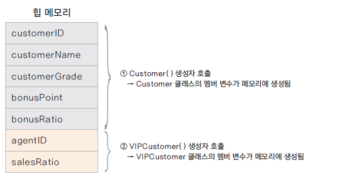

# 03. 상속에서 클래스 생성 과정과 형 변환

## 하위 클래스가 생성 되는 과정

- 하위 클래스를 생성하면 상위 클래스가 먼저 생성 됨 

- new VIPCustomer()를 호출하면 Customer()가 먼저 호출 됨

- 클래스가 상속 받은 경우 하위 클래스의 생성자에서는 반드시 상위 클래스의 생성자를 호출 함

Customer.java
```
public Customer() {
		customerGrade = "SILVER";
		bonusRatio = 0.01;
		
		System.out.println("Customer() 생성자 호출");
}
```

VIPCustomer.java
```
public VIPCustomer() {
		customerGrade = "VIP";
		bonusRatio = 0.05;
		salesRatio = 0.1;
		
		System.out.println("VIPCustomer() 생성자 호출");
}
```

## super 키워드

- 하위 클래스에서 가지는 상위 클래스에 대한 참조 값

- super()는 상위 클래스의 기본 생성자를 호출 함

- 하위 클래스에서 명시적으로 상위 클래스의 생성자를 호출하지 않으면 super()가 호출 됨<br>
  ( 이때 반드시 상위 클래스의 기본 생성자가 존재 해야 함)

- 상위 클래스의 기본 생성자가 없는 경우 ( 다른 생성자가 있는 경우 ) 하위 클래스에서는 생성자에서는 super를 이용하여 
명시적으로 상위 클래스의 생성자를 호출 함

- super는 생성된 상위 클래스 인스턴스의 참조 값을 가지므로 super를 이용하여 상위 클래스의 메서드나 멤버 변수에 접근할 수 있음

## 상속에서 인스턴스 메모리의 상태 

- 항상 상위 클래스의 인스턴스가 먼저 생성되고, 하위 클래스의 인스턴스가 생성 됨


