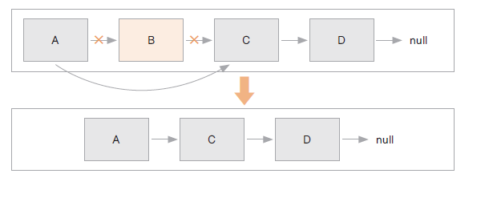
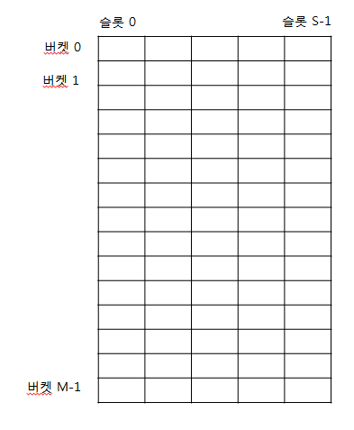

# 01. 여러가지 자료구조에 대해 알아봅시다.

## 자료구조란 무엇인가? (Data Structure)

- 프로그램에서 사용할 많은 데이타를 메모리 상에서 관리하는 여러 구현방법들

- 효율적인 자료구조가 성능 좋은 알고리즘의 기반이 됨

- 자료의 효율적인 관리는 프로그램의 수행속도와 밀접한 관련이 있음

- 여러 자료 구조 중에서 구현하려는 프로그램에 맞는 최적의 자료구조를 활용해야 하므로 자료구조에 대한 이해가 중요함

## 자료구조에는 어떤 것들이 있나?

- **한 줄로 자료를 관리하기 (선형 자료구조)**

 ** 배열 (Array)**  : 선형으로 자료를 관리, 정해진 크기의 메모리를 먼저 할당받아 사용하고, 자료의 물리적 위치와 논리적 위치가 같음

  **연결 리스트 (LinkedList)** : 선형으로 자료를 관리, 자료가 추가될 때마다 메모리를 할당 받고, 자료는 링크로 연결됨. 자료의 물리적 위치와 논리적 위치가 다를 수 있음

리스트에 자료 추가하기  

리스트에서 자료 삭제하기  

  **스택 (Stack)** : 가장 나중에 입력 된 자료가 가장 먼저 출력되는 자료 구조 (Last In First OUt)  

 **큐 (Queue)** :  가장 먼저 입력 된 자료가 가장 먼저 출력되는 자료 구조 (First In First Out)  

- **트리 (Tree)** : 부모 노드와 자식 노드간의 연결로 이루어진 자료 구조  

**이진 트리 (binary tree)** : 부모노드에 자식노드가 두 개 이하인 트리  

**이진 검색 트리** (binary search tree) 
 
 
 
    자료(key)의 중복을 허용하지 않음

    왼쪽 자식 노드는 부모 노드보다 작은 값, 오른쪽 자식 노드는 부모 노드보다 큰 값을 가짐

    자료를 검색에 걸리는 시간이 평균 log(n) 임

    inorder traversal 탐색을 하게 되면 자료가 정렬되어 출력됨 

  예) [23, 10, 28, 15, 7, 22, 56] 순으로 자료를 넣을때 BST  

  

  jdk 클래스 : TreeSet, TreeMap (Tree로 시작되는 클래스는 정렬을 지원 함)

- **그래프 (Graph)** :  정점과 간선들의 유한 집합 G = (V,E)
    
    정점(vertex) : 여러 특성을 가지는 객체, 노드(node) 

    간선(edge) : 이 객체들을 연결 관계를 나타냄. 링크(link)

    간선은 방향성이 있는 경우와 없는 경우가 있음

    그래프를 구현하는 방법 : 인접 행렬(adjacency matrix), 인접 리스트(adjacency list)

    그래프를 탐색하는 방법 : BFS(bread first search), DFS(depth first search)
    
  그래프의 예)  

  

- **해싱 (Hashing)** : 자료를 검색하기 위한 자료 구조

    검색을 위한 자료 구조

    키(key)에 대한 자료를 검색하기 위한 사전(dictionary) 개념의 자료 구조

    key는 유일하고 이에 대한 value를 쌍으로 저장

    index = h(key) : 해시 함수가 key에 대한 인덱스를 반환해줌 해당 인덱스 위치에 자료를 저장하거나 검색하게 됨 

    해시 함수에 의해 인덱스 연산이 산술적으로 가능 O(1)

    저장되는 메모리 구조를 해시테이블이라 함

    jdk 클래스 : HashMap, Properties

  해시테이블  

  

  체이닝  
  

  

