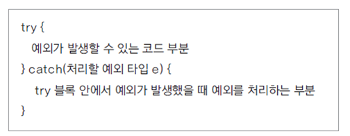

# 09. 예외 처리하기와 미루기

## try-catch 문

- try 블록에는 예외가 발생할 가능성이 있는 코드를 작성하고 try 블록 안에서 예외가 발생하믄 경우 catch 블록이 수행됨



- 프로그래머가 예외를 처리해줘야 하는 예 (배열의 오류 처리)
```
public class ArrayExceptionHandling {

	public static void main(String[] args) {
		int[] arr = {1,2,3,4,5};
		try{
			for(int i=0; i<=5; i++){
				System.out.println(arr[i]);
			}
		}catch(ArrayIndexOutOfBoundsException e){
			System.out.println(e);
		}
		System.out.println("비정상 종료되지 않았습니다.");
	}
}
```

- 컴파일러에 의해 예외가 처리 되는 예 (파일 에러 처리)
```
public class FileExceptionHandling {

	public static void main(String[] args) {
		FileInputStream fis = null;
		try {
			fis = new FileInputStream("a.txt");
		} catch (FileNotFoundException e) {
			System.out.println(e);
			//return;
		}finally{
			if(fis != null){
				try {
					fis.close();
				} catch (IOException e) {
					// TODO Auto-generated catch block
					e.printStackTrace();
				}
			}
			System.out.println("항상 수행 됩니다.");
		}
		System.out.println("여기도 수행됩니다.");
	}
}
```
