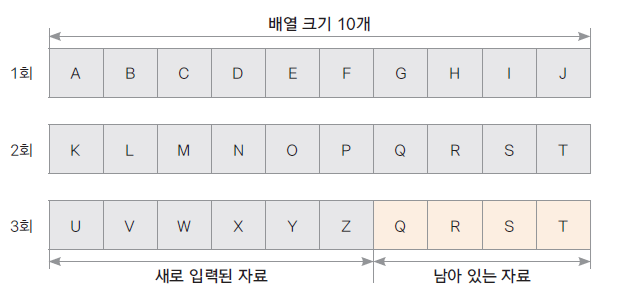

# 14. 바이트 단위 입출력 스트림

# InputStream 

- 바이트 단위 입력 최상위 추상 클래스 스트림

- 많은 추상 메서드가 선언되어 있고 이를 하위 스트림이 상속받아 구현함

- 주요 하위 클래스

| 스트림 클래스 | 설명 |
| ------ | ------ |
| FileInputStream | 파일에서 바이트 단위로 자료를 읽습니다. |
| ByteArrayInputStream | byte 배열 메모리에서 바이트 단위로 자료를 읽습니다. |
| FilterInputStream | 기반 스트림에서 자료를 읽을 때 추가 기능을 제공하는 보조 스트림의 상위 클래스 |

- 주요 메서드

| 메서드 | 설명 |
| ------ | ------ |
| int read() | 입력 스트림으로부터 한 바이트의 자료를 읽습니다. 읽은 자료의 바이트 수를 반환합니다. |
| int read(byte b[]) | 입력 스트림으로 부터 b[] 크기의 자료를 b[]에 읽습니다. 읽은 자료의 바이트 수를 반환합니다. |
| int read(byte b[], int off, int len) | 입력 스트림으로 부터 b[] 크기의 자료를 b[]의 off변수 위치부터 저장하며 len 만큼 읽습니다. 읽은 자료의 바이트 수를 반환합니다. |
| void close() | 입력 스트림과 연결된 대상 리소스를 닫습니다. |

### FileInputStream 예제

- 파일에서 한 바이트씩 자료 읽기
```
public class FileInputStreamTest1 {

	public static void main(String[] args) {
		FileInputStream fis = null;
		
		try {
			fis = new FileInputStream("input.txt");
		
			System.out.println((char)fis.read());
			System.out.println((char)fis.read());
			System.out.println((char)fis.read());
		
		} catch (IOException e) {
			System.out.println(e);
		} finally{
			try {
				fis.close();
			} catch (IOException e) {
				System.out.println(e);
			} catch (NullPointerException e){
				System.out.println(e);
			}
		}
		System.out.println("end");
	}

}
```
- 파일의 끝까지 한 바이트씩 자료 읽기

```
public class FileInputStreamTest2 {

	public static void main(String[] args) {

		try(FileInputStream fis = new FileInputStream("input.txt")){ 
			int i;
			while ( (i = fis.read()) != -1){
				System.out.println((char)i);
			}
			System.out.println("end");
		} catch (FileNotFoundException e) {
			e.printStackTrace();
		} catch (IOException e) {
			e.printStackTrace();
		}
	}

}
```

- 파일에서 바이트 배열로 자료 읽기 ( 배열에 남아 있는 자료가 있을 수 있음에 유의 )

```
public class FileInputStreamTest3 {

	public static void main(String[] args) {
		 		
		try (FileInputStream fis = new FileInputStream("input2.txt")){
			
			byte[] bs = new byte[10];
			int i;
			while ( (i = fis.read(bs)) != -1){
				/*for(byte b : bs){
					System.out.print((char)b);
				}*/
				for(int k= 0; k<i; k++){
					System.out.print((char)bs[k]);
				}
				System.out.println(": " +i + "바이트 읽음" );
			}
		} catch (IOException e) {
			e.printStackTrace();
		}
		System.out.println("end");
	}
}
```



