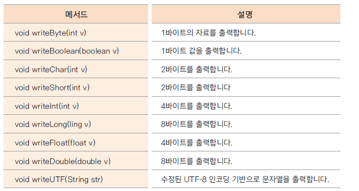

# 16. 여러가지 보조 스트림 클래스들

## 보조 스트림 

- 실제 읽고 쓰는 스트림이 아닌 보조 기능을 추가하는 스트림

- FilterInputStream과 FilterOutputStream 이 보조 스트림의 상위 클래스들

- 생성자의 매개변수로 또 다른 스트림(기반 스트림이나 다른 보조 스트림)을 가짐

- 상위 클래스 생성자

| 생성자 | 설명 |
| ------ | ------ |
| protected FilterInputStream과(InputStream in) | 생성자의 매개변수로 InputStream을 받습니다. |
| public FilterOutputStream(OutputStream out) | 생성자의 매개변수로 OutputStream을 받습니다. |


### InputStreamReader와 OutputStreamWriter

- 바이트 단위로 읽거나 쓰는 자료를 문자로 변환해주는 보조 스트림

- FilterInputStream으로 읽은 자료를 문자로 변환해주는 예

```
public class InputStreamReaderTest {

	public static void main(String[] args) {

		try(InputStreamReader isr = new InputStreamReader(new FileInputStream("reader.txt"))){
			int i;
			while( (i = isr.read()) != -1){  //보조 스트림으로 읽습니다.
				System.out.print((char)i);
			}
		}catch(IOException e) {
			e.printStackTrace();
		}
	}
}
```

### BufferedInputStream과 BufferedOutputStream 

- 약 8k의 배열이 제공되어 입출력이 빠르게 하는 기능이 제공되는 보조 스트림

- BufferedReader와 BufferedWriter는 문자용 입출력 보조 스트림

```
public class BufferedStreamTest {

	public static void main(String[] args) {

		long millisecond = 0;
		try(FileInputStream fis = new FileInputStream("a.zip");
				FileOutputStream fos = new FileOutputStream("copy.zip");
				BufferedInputStream bis = new BufferedInputStream(fis);
				BufferedOutputStream bos = new BufferedOutputStream(fos)){
		
			millisecond = System.currentTimeMillis();
			
			int i;
			while( ( i = bis.read()) != -1){
				bos.write(i);
			}
			
			millisecond = System.currentTimeMillis() - millisecond;
		}catch(IOException e) {
			e.printStackTrace();
		}
		
		System.out.println("파일 복사 하는 데 " + millisecond + " milliseconds 소요되었습니다.");
	}
}
```

### DataInputStream과 DataOutputStream

- 자료가 메모리에 저장된 상태 그대로 읽거나 쓰는 스트림

- DataInputStream 메서드


- DataOutputStream 메서드



```
public class DataStreamTest {

	public static void main(String[] args) {


		try(FileOutputStream fos = new FileOutputStream("data.txt");
				DataOutputStream dos = new DataOutputStream(fos))
		{
		
			dos.writeByte(100);
			dos.writeChar('A');
			dos.writeInt(10);
			dos.writeFloat(3.14f);
			dos.writeUTF("Test");
		}catch(IOException e) {
			e.printStackTrace();
		}
		
		try(FileInputStream fis = new FileInputStream("data.txt");
				DataInputStream dis = new DataInputStream(fis))
		{
		
			System.out.println(dis.readByte());
			System.out.println(dis.readChar());
			System.out.println(dis.readInt());
			System.out.println(dis.readFloat());
			System.out.println(dis.readUTF());
		}catch (IOException e) {
			e.printStackTrace();
		}
	}
}
```


