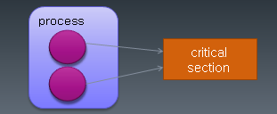

# 20. 자바에서 Thread 만들기

## Thread 란?

- process 
  실행 중인 프로그램
  프로그램이 실행되면 OS로 부터 메모리를 할당받아 프로세스 상태가 됨

- thread
  하나의 프로세스는 하나 이상의 thread를 가지게 되고, 실제 작업을 수행하는 단위는 thread임
  


## multi-threading 

- 여러 thread가 동시에 수행되는 프로그래밍, 여러 작업이 동시에 실행되는 효과

- thread는 각각 자신만의 작업 공간을 가짐 ( context )

- 각 thread 사이에서 공유하는 자원이 있을 수 있음 (자바에서는 static instance)

- 여러 thread가 자원을 공유하여 작업이 수행되는 경우 서로 자원을 차지하려는 race condition이 발생할 수 있음

- 이렇게 여러 thread가 공유하는 자원중 경쟁이 발생하는 부분을 critical section 이라고 함

- critical section에 대한 동기화( 일종의 순차적 수행)를 구현하지 않으면 오류가 발생할 수 있음




## 자바 Thread 만들기

### Thread 클래스 상속하여 만들기

```
class MyThread extends Thread{
	
	public void run() {
		
		int i;
		for(i = 0; i<200; i++) {
			System.out.print(i + "\t");
		}
	}
}

public class ThreadTest {

	public static void main(String[] args) {

		System.out.println(Thread.currentThread());
		MyThread th1 = new MyThread();
		th1.start();
		
		MyThread th2 = new MyThread();
		th2.start();
	}

}
```

### Runnable 인터페이스 구현하여 만들기

```
class MyThread2 implements Runnable{

	public void run(){
		
		int i;
		for(i=0; i<200; i++){
			
			System.out.print(i + "\t");
	
			
		}
	}
}


public class ThreadTest2 {

	public static void main(String[] args) {

		System.out.println("main start");
		
		MyThread2 mth = new MyThread2();
		Thread th1 = new Thread(mth);
		th1.start();
		
		Thread th2 = new Thread(new MyThread2());
		th2.start();
		
		System.out.println("main end");
	}

}
```
